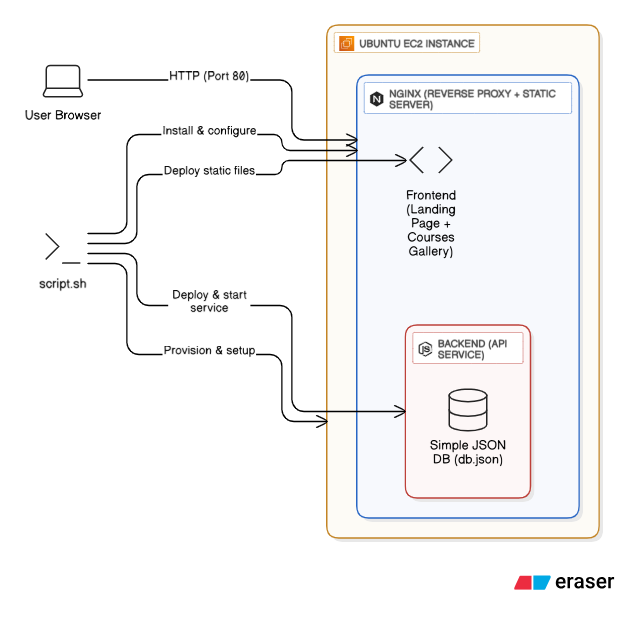

# 🌐 Tech With Diwana — E-Commerce Learning Site Demo

[](https://github.com/techwithdiwana/techwithdiwana-ecom-learning-site)
[](https://github.com/techwithdiwana/techwithdiwana-ecom-learning-site/commits/main)
[](LICENSE)

📺 **YouTube:** [Tech With Diwana](https://youtube.com/@techwithdiwana)  
🔔 **Subscribe** to support and learn DevOps + IT hands-on projects.

---

## 🔭 About

This repository contains a professional **E-Commerce Learning Site Demo** for **Tech With Diwana**.  
It demonstrates how to deploy a **static frontend with an optional Node.js backend** on a single **Ubuntu EC2 instance using NGINX**.

### ✨ Key Features
- Responsive landing page: **Welcome To Tech With Diwana**
- E-commerce style course gallery with title, description, and price
- Demo backend (`/api/courses`) serving JSON course list + purchase API
- One-click deploy script (`script.sh`) to set up everything on Ubuntu/EC2
- Beginner-friendly: safe defaults, idempotent script, no destructive commands

---

## 🏗 Architecture

**System flow:**

```
Browser → NGINX → (Static frontend: HTML/CSS/JS)
                     ↘ (Optional backend: Node.js via /api/ proxy)
```



---

## 🖥 First Page Preview


> **Welcome To Tech With Diwana**  
> Curated IT courses & hands-on projects — learn, build, deploy.

_Course Cards Example:_  
- DevOps Bootcamp — CI/CD, Docker, Kubernetes  
- Fullstack JS — React + Node.js  

---

## 🚀 Deployment Steps (Ubuntu / EC2)

### Option A — Automated (recommended)

Upload `script.sh` and run:
```bash
chmod +x script.sh
# with backend
sudo ./script.sh
# without backend
ENABLE_BACKEND=false sudo ./script.sh
```

### Option B — Manual Steps

1. **Connect to server:**
```bash
ssh -i "your-key.pem" ubuntu@<EC2-PUBLIC-IP>
```

2. **Install required packages:**
```bash
sudo apt update
sudo apt install -y nginx git curl jq
```

3. **Clone repo to site root:**
```bash
sudo mkdir -p /var/www/techwithdiwana
sudo git clone https://github.com/techwithdiwana/techwithdiwana-ecom-learning-site.git /var/www/techwithdiwana
```

4. **Set permissions:**
```bash
sudo chown -R www-data:www-data /var/www/techwithdiwana
sudo find /var/www/techwithdiwana -type d -exec chmod 755 {} \;
sudo find /var/www/techwithdiwana -type f -exec chmod 644 {} \;
```

5. **Create Nginx site config `/etc/nginx/sites-available/techwithdiwana`:**
```nginx
server {
  listen 80 default_server;
  listen [::]:80 default_server;
  server_name _;

  root /var/www/techwithdiwana;
  index index.html;

  # API proxy to backend
  location ^~ /api/ {
    proxy_pass http://127.0.0.1:3000;
    proxy_http_version 1.1;
    proxy_set_header Upgrade $http_upgrade;
    proxy_set_header Connection "upgrade";
    proxy_set_header Host $host;
    proxy_set_header X-Real-IP $remote_addr;
    proxy_set_header X-Forwarded-For $proxy_add_x_forwarded_for;
  }

  location / {
    try_files $uri $uri/ /index.html;
  }

  location ~* \.(?:css|js|jpg|jpeg|png|gif|ico|svg|webp)$ {
    expires 7d;
    add_header Cache-Control "public";
  }
}
```

6. **Enable site & reload nginx:**
```bash
sudo ln -sf /etc/nginx/sites-available/techwithdiwana /etc/nginx/sites-enabled/techwithdiwana
sudo rm -f /etc/nginx/sites-enabled/default
sudo nginx -t
sudo systemctl reload nginx
```

7. **Open in browser:**
```
http://<EC2-PUBLIC-IP>
```

---

## 📂 Project structure

```
techwithdiwana-ecom-learning-site/
├── index.html
├── styles.css
├── app.js
├── backend/ (optional Node backend)
├── script.sh
├── README.md
├── LICENSE
├── architecture.png
└── firstpage.png
```

---

## 🛡 License

MIT License — see [LICENSE](LICENSE).

---

## 👨‍🏫 Author & Contact

**Tech With Diwana**  
- YouTube: [Tech With Diwana](https://youtube.com/@techwithdiwana)  
- Email: your-email@example.com

---

# Tech With Diwana — E-Commerce Learning Site (Updated README)

**Repository:** https://github.com/techwithdiwana/techwithdiwana-ecom-learning-site

This README has been updated to include exact, linear manual deployment steps that reproduce the behavior of `script.sh`.  
Run commands on an **Ubuntu/Debian** server as `root` or with `sudo`. These commands are copy-paste ready.

---

## Quick summary

- Installs required packages (nginx, git, curl, jq)
- Deploys static files to `/var/www/techwithdiwana` (shallow clone -> copy)
- Ensures `index.html` exists
- Sets ownership to `www-data:www-data` and correct permissions
- Writes Nginx site config at `/etc/nginx/sites-available/techwithdiwana`
- Enables the site and removes default
- Installs Node 18 and creates a demo Node backend at `/opt/techwithdiwana/backend`
- Creates a systemd service `techwithdiwana-backend` and starts it
- Tests and reloads Nginx

---

## Exact manual steps (run in order)

### 1) Update & install required packages
```bash
sudo apt-get update -y
sudo apt-get install -y nginx git curl jq
```

### 2) Create site root, shallow-clone repo to temp, and copy files to site root
```bash
SITE_ROOT=/var/www/techwithdiwana
REPO_URL="https://github.com/techwithdiwana/techwithdiwana-ecom-learning-site.git"

sudo mkdir -p "$SITE_ROOT"
TMP="/tmp/techwithdiwana_deploy_$$"
sudo rm -rf "$TMP"
git clone --depth=1 "$REPO_URL" "$TMP"
sudo cp -rv "$TMP"/* "$SITE_ROOT"/
sudo rm -rf "$TMP"
```

### 3) Ensure index.html exists (create fallback if missing)
```bash
sudo test -f "$SITE_ROOT/index.html" || sudo tee "$SITE_ROOT/index.html" > /dev/null <<'HTML'
<!doctype html><html><head><meta charset="utf-8"><meta name="viewport" content="width=device-width,initial-scale=1"><title>Welcome To Tech With Diwana</title></head><body><h1>Welcome To Tech With Diwana</h1></body></html>
HTML
```

### 4) Set ownership and permissions
```bash
sudo chown -R www-data:www-data "$SITE_ROOT"
sudo find "$SITE_ROOT" -type d -exec chmod 755 {} \;
sudo find "$SITE_ROOT" -type f -exec chmod 644 {} \;
```

### 5) Write the nginx site config (exact content)
Create `/etc/nginx/sites-available/techwithdiwana` with the following content:
```nginx
server {
    listen 80 default_server;
    listen [::]:80 default_server;
    server_name _;

    root /var/www/techwithdiwana;
    index index.html;

    # API proxy
    location ^~ /api/ {
        proxy_pass http://127.0.0.1:3000;
        proxy_http_version 1.1;
        proxy_set_header Upgrade $http_upgrade;
        proxy_set_header Connection "upgrade";
        proxy_set_header Host $host;
        proxy_set_header X-Real-IP $remote_addr;
        proxy_set_header X-Forwarded-For $proxy_add_x_forwarded_for;
    }

    # serve static files; fallback to index.html for SPA-like behavior
    location / {
        try_files $uri $uri/ /index.html;
    }

    location ~* \.(?:css|js|jpg|jpeg|png|gif|ico|svg|webp)$ {
        expires 7d;
        add_header Cache-Control "public";
    }
}
```

### 6) Enable site and remove default
```bash
sudo ln -sf /etc/nginx/sites-available/techwithdiwana /etc/nginx/sites-enabled/techwithdiwana
sudo rm -f /etc/nginx/sites-enabled/default
```

### 7) Create backend folder and demo Node server
```bash
BACKEND_DIR=/opt/techwithdiwana/backend
sudo mkdir -p "$BACKEND_DIR"

sudo tee "$BACKEND_DIR/server.js" > /dev/null <<'NODE'
const express = require('express');
const fs = require('fs').promises;
const path = require('path');
const app = express();
app.use(express.json());
const DB = path.join(__dirname,'db.json');
async function readDB(){ try { return JSON.parse(await fs.readFile(DB,'utf8')); } catch(e){ return { courses: [] }; } }
async function writeDB(d){ await fs.writeFile(DB, JSON.stringify(d, null, 2)); }
app.get('/api/courses', async (req,res)=>{ const db = await readDB(); res.json(db.courses || []); });
app.post('/api/purchase', async (req,res)=>{ const {courseId,user} = req.body || {}; if(!courseId) return res.status(400).json({error:'courseId required'}); const db = await readDB(); db.purchases = db.purchases || []; db.purchases.push({id:Date.now(), courseId, user, ts: new Date().toISOString()}); await writeDB(db); res.json({success:true}); });
const PORT = process.env.PORT || 3000; app.listen(PORT, ()=> console.log('Backend listening on', PORT));
NODE

sudo tee "$BACKEND_DIR/db.json" > /dev/null <<'DB'
{
  "courses": [
    {"id":"c1","title":"DevOps Bootcamp","description":"CI/CD, Docker, Kubernetes","price":999,"image":"https://via.placeholder.com/400x250?text=DevOps+Course"},
    {"id":"c2","title":"Fullstack JS","description":"React + Node.js","price":799,"image":"https://via.placeholder.com/400x250?text=Fullstack+JS"}
  ]
}
DB
```

### 8) Install Node 18 and npm dependencies
```bash
curl -fsSL https://deb.nodesource.com/setup_18.x | sudo bash -
sudo apt-get install -y nodejs
cd "$BACKEND_DIR"
sudo npm init -y >/dev/null 2>&1 || true
sudo npm install express >/dev/null 2>&1 || true
```

### 9) Create systemd service and start backend
```bash
sudo tee /etc/systemd/system/techwithdiwana-backend.service > /dev/null <<'SERVICE'
[Unit]
Description=TechWithDiwana Backend
After=network.target

[Service]
ExecStart=/usr/bin/node /opt/techwithdiwana/backend/server.js
Restart=on-failure
User=www-data
WorkingDirectory=/opt/techwithdiwana/backend

[Install]
WantedBy=multi-user.target
SERVICE

sudo systemctl daemon-reload
sudo systemctl enable --now techwithdiwana-backend
```

### 10) Test nginx config and reload
```bash
sudo nginx -t
sudo systemctl reload nginx
```

### 11) Verification
```bash
curl -fsS http://127.0.0.1/ || echo "static failed"
curl -fsS http://127.0.0.1/app.js || curl -fsS http://127.0.0.1/index.html
curl -fsS http://127.0.0.1:3000/api/courses || echo "backend not responding"
sudo systemctl status techwithdiwana-backend --no-pager
sudo journalctl -u techwithdiwana-backend -n 80 --no-pager
```

### 12) Open in browser
```
http://<EC2-PUBLIC-IP>/
```
Ensure EC2 Security Group allows inbound TCP 80.

---

## Notes
- These steps are linear and mirror the `script.sh` behavior exactly.
- If you **do not** want the demo backend, skip steps 7-9 and remove or comment the `/api/` proxy block in the nginx config.

---

## License
MIT

